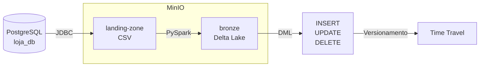

# Trabalho 2 — Apache Spark com MinIO e Delta Lake

Projeto da disciplina **Arquitetura de Dados — SATC**.

## Objetivo

Implementar um pipeline de dados completo utilizando Apache Spark, MinIO (object storage compatível com S3) e Delta Lake, partindo de um banco de dados PostgreSQL como fonte.

## Arquitetura do Pipeline



## Tecnologias utilizadas

| Tecnologia | Versão | Função |
|---|---|---|
| Apache Spark | 3.5.1 | Processamento distribuído |
| Delta Lake | 3.2.0 | Formato de tabela com ACID |
| MinIO | latest | Object storage (S3 compatível) |
| PostgreSQL | 15 | Banco de dados fonte |
| Python | 3.12 | Linguagem de desenvolvimento |
| Poetry | 1.8+ | Gerenciamento de pacotes |

## Estrutura do projeto

```
.
├── docker-compose.yml       # MinIO + PostgreSQL
├── pyproject.toml           # Dependências (Poetry)
├── README.md
├── data/
│   └── init.sql             # Script de criação e carga do PostgreSQL
├── notebooks/
│   └── 01-pipeline-minio-delta.ipynb
├── docs/                    # Páginas MkDocs
└── mkdocs.yml
```
