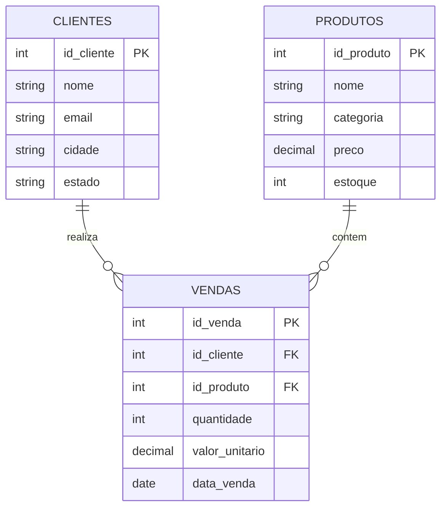

# 🗄️ PostgreSQL e MinIO

## PostgreSQL — banco de dados fonte

### Modelo de dados

O banco `loja_db` possui 3 tabelas relacionadas:



### DDL das tabelas

```sql
CREATE TABLE produtos (
    id_produto SERIAL PRIMARY KEY,
    nome       VARCHAR(100) NOT NULL,
    categoria  VARCHAR(50),
    preco      NUMERIC(10, 2),
    estoque    INTEGER
);

CREATE TABLE clientes (
    id_cliente SERIAL PRIMARY KEY,
    nome       VARCHAR(100) NOT NULL,
    email      VARCHAR(100),
    cidade     VARCHAR(50),
    estado     VARCHAR(2)
);

CREATE TABLE vendas (
    id_venda       SERIAL PRIMARY KEY,
    id_cliente     INTEGER REFERENCES clientes(id_cliente),
    id_produto     INTEGER REFERENCES produtos(id_produto),
    quantidade     INTEGER,
    valor_unitario NUMERIC(10, 2),
    data_venda     DATE
);
```

---

## MinIO — Object Storage

MinIO é um sistema de armazenamento de objetos de alta performance, compatível com a API do Amazon S3. Ele é usado neste projeto como substituto local do S3.

### Buckets utilizados

| Bucket | Formato | Descrição |
|---|---|---|
| `landing-zone` | CSV | Dados brutos extraídos do PostgreSQL |
| `bronze` | Delta Lake | Dados convertidos, prontos para DML |

### Configuração via Docker Compose

```yaml
minio:
  image: minio/minio:latest
  environment:
    MINIO_ROOT_USER: minioadmin
    MINIO_ROOT_PASSWORD: minioadmin123
  ports:
    - "9000:9000"   # API S3
    - "9001:9001"   # Console web
  command: server /data --console-address ":9001"
```

### Como subir o ambiente

```bash
docker compose up -d
```

Acesse o console em [http://localhost:9001](http://localhost:9001) com usuário `minioadmin` / senha `minioadmin123`.

### Extração: PostgreSQL → landing-zone

```python
for tabela in ["produtos", "clientes", "vendas"]:
    df = spark.read.jdbc(url=PG_URL, table=tabela, properties=pg_props)
    df.write \
        .mode("overwrite") \
        .option("header", "true") \
        .csv(f"s3a://landing-zone/{tabela}")
```

!!! info "Formato CSV"
    Para bancos relacionais, os dados são gravados em CSV na landing-zone, conforme especificado no trabalho.
